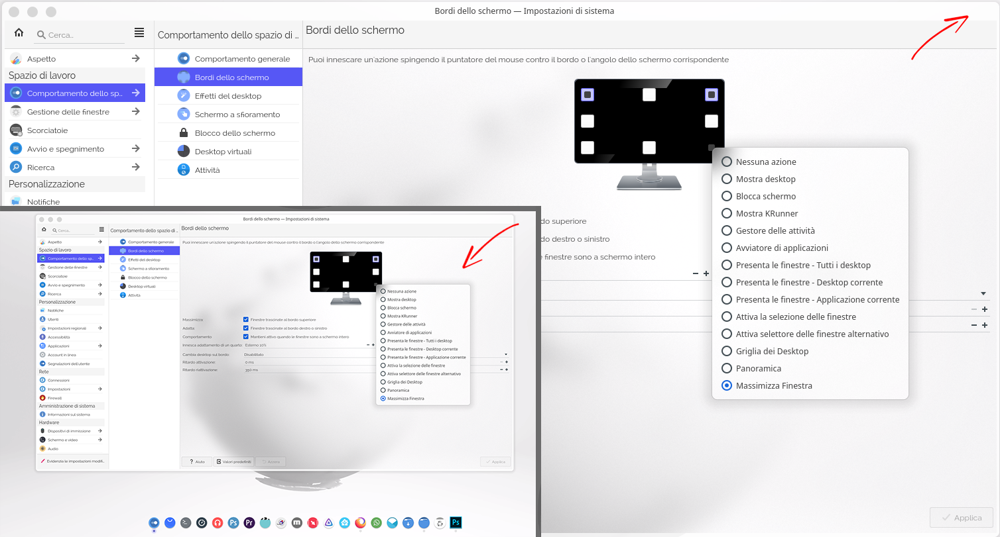

# Plasma_Kwin_Maximize_Window
Utility script to activate Maximize Window from screen edge.

**License:** GPL v3

**Developer:** [Repositories](https://github.com/kyokusa)

**More info :** https://www.pling.com/

### Platform

_KDE Plasma 5.25.3

 

### **Donations**
The ¨Maximize Window¨ script is free and unconstrained, so like me, other people can use it with the convenience of active corners that Plasma offers.
In any case, any recognition will be highly appreciated.
 
 
 
